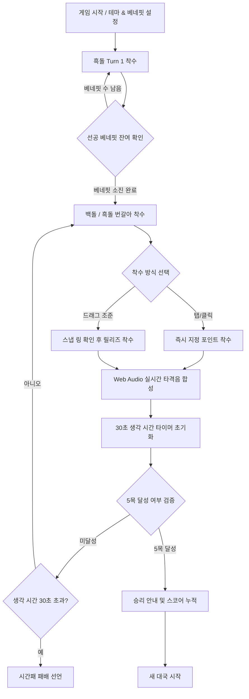

# 🏆 Premium Omok (프리미엄 2D/3D 터치 오목)

[](https://developer.mozilla.org/en-US/docs/Web/Guide/HTML/HTML5)
[](https://developer.mozilla.org/en-US/docs/Web/CSS)
[](https://developer.mozilla.org/en-US/docs/Web/JavaScript)
[](https://threejs.org/)
[](https://developer.mozilla.org/en-US/docs/Web/API/Web_Audio_API)

> **Premium Omok**은 데스크톱, 태블릿, **터치스크린 노트북** 및 다양한 모바일 디바이스에 최적화된 고품격 **오목(Gomoku) 웹 애플리케이션**입니다. 
> 별도의 설치나 회원 가입 없이, 다운로드 후 더블 클릭 한 번으로 미려한 비주얼과 실감 나는 소리의 오목 대국을 즐기실 수 있습니다.

---

## 📖 핵심 설명 및 도움말 링크
게임의 전체적인 설명과 시각화된 조작 매뉴얼은 패키지 내에 생성된 **인터랙티브 가이드 페이지**에서 바로 확인하실 수 있습니다.

👉 **[Premium Omok 대화형 가이드 페이지 (`guide.html`) 열기](guide.html)**

---

## 🌟 주요 특징 (Key Features)

### 1. 🎯 터치스크린 특화 드래그 조준 & 스냅 (Pointer Snapping)
손가락 터치 시 바둑판 눈금이 가려져 착수 실수가 일어나는 터치 노트북/모바일 기기의 단점을 완벽하게 보완한 **하이브리드 조준 시스템**을 도입했습니다.
* **드래그 조준**: 바둑판 위를 터치하고 드래그하면 가장 가까운 빈 교차점에 빛나는 링 가이드라인이 투영되어 부드럽게 스냅됩니다.
* **손가락 놓기(Release)**: 가이드링으로 안전하게 착수 위치를 확인한 후 손가락을 떼는 순간(`pointerup`) 정확하게 돌이 놓입니다.
* **클릭 조작**: 기존의 빈 공간을 원터치로 직접 클릭하여 놓는 마우스 조작 방식도 당연히 병행 호환됩니다.

### 2. 🔮 실시간 2D / 3D 테마 스위칭 (Three.js Engine)
HTML5 Canvas 2D 렌더링에 기반한 평면 뷰와, Three.js 3D 그래픽스 렌더러에 기반한 입체 뷰를 실시간으로 전환할 수 있습니다. 
* 3D 모드에서는 마우스 드래그를 통해 바둑판을 자유로운 시점과 각도로 회전(Orbit), 이동(Pan), 확대/축소(Zoom)하여 플레이할 수 있어 대국의 입체감이 극대화됩니다.

### 3. 🔊 실시간 웹 사운드 합성 (Web Audio API Synth)
사운드 리소스 로딩에 따른 시간 지연이나 유실 문제를 방지하기 위해 브라우저 내장 오실레이터를 이용한 **물리 기반 실시간 소리 합성**을 구축했습니다.
* **흑돌 (slate)**: 묵직하고 단단한 밀도를 표현하는 180Hz 기반의 중저음 타격 공명음.
* **백돌 (shell)**: 맑고 영롱한 조개껍질의 울림을 표현하는 220Hz 기반의 고음역 타격음.
* **공명통 효과**: 나무 바둑판을 직접 타격하는 듯한 깊은 공명 필터링을 적용했습니다.

### 4. ⏱️ 30초 생각 시간 초읽기 (Countdown Timer)
대국의 긴장감을 높이고 템포를 원활히 조율하기 위해 시간제한 시스템을 운용합니다.
* **초읽기 시각화**: 턴당 30초의 타이머와 시각 게이지 바를 제공합니다.
* **비프 경보음**: 5초 이하부터 게이지가 적색으로 반짝이고 800Hz의 경고 비프음이 발생하며, 마지막 2초 동안은 더 조급한 1200Hz 비프음으로 자동 전환됩니다. 시간 초과 시 시간패 처리됩니다.

### 5. 🎁 선공 베네핏 설정 (Advantage Rules)
흑돌(선공)의 유리함을 극복하기 위해 첫 턴에 흑돌이 연속해서 몇 개의 돌을 둘 수 있을지 0~3개 범위에서 설정할 수 있습니다. (첫 턴 이후부터는 평범하게 교대 착수)

---

## 🔄 게임 플레이 흐름도 (Game Flow)



---

## 🛠️ 기술 스택 (Technical Stack)

* **Core**: HTML5, JavaScript (ES6+), Vanilla CSS3
* **Rendering Engine**: HTML5 Canvas 2D / Three.js 3D (WebGL Renderer)
* **Audio Synthesis**: Web Audio API (OscillatorNode, GainNode, BiquadFilterNode)
* **Interaction**: PointerEvents API (마우스, 터치, 스타일러스 펜 통합 제어)
* **Data Persistence**: Web LocalStorage API (전적 누적 보존)

---

## 🚀 실행 및 플레이 방법 (How to Run)

### 방법 A. play.bat 더블 클릭 실행 (가장 추천)
1. 본 프로젝트 저장소의 폴더를 컴퓨터에 다운로드합니다.
2. 폴더 내에 있는 **`play.bat`** 파일을 찾아 더블 클릭합니다.
3. 시스템 기본 브라우저가 실행되며 즉시 고해상도 오목판이 펼쳐집니다!

### 방법 B. 로컬 웹 서버 서빙 (엄격한 브라우저 테스트용)
구글 크롬 최신 보안 버전 등 로컬 파일 오리진(`file://`)에 오디오 컨텍스트 보안 제약을 걸어두는 브라우저를 대비해, 로컬 서버를 통해 구동하는 방법입니다.
1. 터미널(PowerShell 또는 CMD)을 실행합니다.
2. 오목 폴더 경로로 이동하여 아래 명령어를 실행합니다:
   ```bash
   npx -y http-server . -o
   ```
3. 브라우저가 `http://localhost:8080` 포트로 자동 연결되며 사운드가 활성화된 대국이 구동됩니다.

---

## 📂 프로젝트 파일 구조 (File Structure)

```
d:\Omok\
├── index.html       # 레이아웃 마크업, 타이머 위젯, 결과 안내 모달
├── guide.html       # [NEW] 상세 디자인 설명서 및 조작법 웹 가이드 페이지
├── styles.css       # 전체 테마 디자인 시스템, 모바일 반응형 뷰포트
├── app.js           # 2D 15x15 오목 엔진, Web Audio 합성, 터치 입력 조종
├── app3d.js         # Three.js 기반 3D 뷰어 렌더러 및 카메라 인터랙션
├── three.min.js     # Three.js 라이브러리 엔진
├── play.bat         # 윈도우 원클릭 런처 스크립트
└── README.md        # 프로젝트 정보 및 GitHub 설명 마크다운
```

---

## ⚖️ 라이선스 및 크레딧
* **제작사**: Antigravity Studio (Developer Pair Programming Assistant)
* **저작권**: Copyright &copy; 2026. Hakhyun Kim. All rights reserved.
